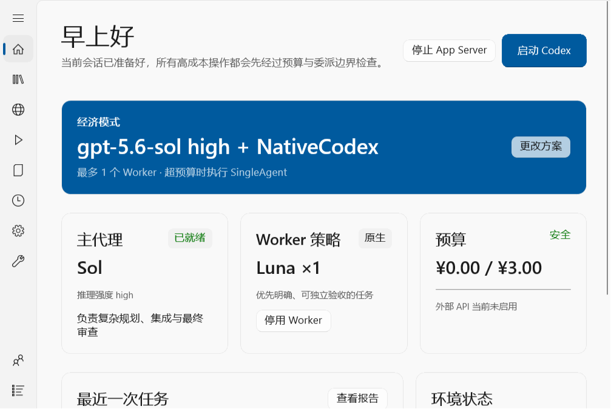

# Codex Agent Switch

Codex Agent Switch（CAS）是一款面向 Windows 的 Codex 桌面控制台，用来集中管理项目、运行配置、原生 Codex Worker、OpenAI-Compatible Provider、委派边界、预算与 Usage 记录。

它解决的不是“替代 Codex”，而是让多个项目和不同执行策略拥有清晰、可审计、可恢复的控制层。

> 当前版本：**0.2.7.2**
>
> 主要平台：Windows 10 22H2 x64；兼容 Windows 11 x64
>
> 技术栈：.NET 8、WinUI 3、Windows App SDK、SQLite



## CAS 能做什么

- 用 Profile 统一管理模型角色、推理强度、审批策略、沙箱策略和 Worker 配置。
- 启动原生 Codex，并为所选项目生成短期、项目级启动配置。
- 在 CAS 托管模式中保存项目、对话、主线程、委派决定、Worker 结果和 Usage 记录。
- 接入 DeepSeek 等 OpenAI-Compatible Provider；Provider 与原生 Codex 模型目录相互独立。
- 使用 Windows Credential Manager 保存 API Key，数据库和日志只记录凭据引用。
- 提供安装、升级、备份、回滚和可恢复卸载流程。
- 区分真实 Usage、估算值和不可取得字段，不用推测值伪装精确统计。

## 两种运行模式

### 原生 Codex 模式

CAS 根据当前 Profile 生成短期配置并启动原始 Codex。Codex 自己负责会话生命周期、原生自动压缩和主线程行为；CAS 负责启动参数、项目配置和 Worker 路由，不接管 Desktop 已拥有的线程。

### CodexAgentSwitch 模式

CAS 管理完整的项目 → 对话 → 主线程层级。每次执行都会固化 Profile 快照、委派决定、Provider/模型信息、Worker 结果、Usage 和消息历史，适合需要可追踪编排与审计的工作流。

更完整的设计说明见 [架构文档](docs/architecture.md)。

## 0.2.7.3：按 Profile 配置上下文压缩

每个 Profile 可独立选择 `节省 · 150K`、`均衡 · 180K`、`连续 · 200K` 或 `默认 · 约218K`。前三档会在明确“应用到项目”时写入 `model_auto_compact_token_limit`；默认档不写该键，由 Codex 使用当前原生默认值。

- 只修改明确选择的 CAS 项目；保存或编辑 Profile 不会改动已经应用的项目。
- 用户已经在项目根级显式设置阈值时，用户值优先，CAS 不覆盖也不创建重复 TOML 键。
- CAS 只配置阈值；真正的自动压缩仍由 Codex 原生执行。
- 新建或重新加载项目对话后生效，当前已运行的对话可能继续使用旧值。
- 原 TOML 内容、配置备份、严格校验和恢复流程保持不变；歧义配置会失败关闭。

详情见 [0.2.7.3 发布说明](docs/release-notes-0.2.7.3.md)。0.2.7.1 的冻结原因与回退边界记录在 [维护说明](docs/maintenance/0.2.7.1-frozen.md) 中。

## 安装与升级

推荐使用完整安装包：

1. 将 `CodexAgentSwitch-Setup-Bundle-win10-x64.zip` 解压到 E 盘目录。
2. 保持 Setup 程序、运行时文件、payload ZIP 和校验文件在同一目录。
3. 运行 `CodexAgentSwitch.Setup.exe`，选择安装目录并完成安装。

安装器会在变更前验证 payload 的 SHA-256。升级时，旧安装会先移动到带时间戳的备份目录，再安装新版本并恢复现有 `data`；失败时会回滚旧目录。

也可以使用 `CodexAgentSwitch-compact-runtime-win10-x64.zip`：保持目录结构完整，运行根目录的 `CodexAgentSwitch.Bootstrapper.exe`。Bootstrapper 会检查 Windows 版本、架构和 Windows App Runtime 1.8，但不会在未经确认时下载或启动运行时安装器。

完整步骤、静默安装参数和回滚说明见 [安装与回滚](docs/install-and-rollback.md)。

## 首次使用

1. 在 CAS 中注册一个项目，并选择项目工作目录。
2. 创建 Profile，选择可用的模型角色、推理强度和审批模式。
3. 如需外部 Worker，添加 OpenAI-Compatible Provider，并将 API Key 保存到 Windows Credential Manager。
4. 将 Profile 应用到项目。
5. 选择“原生 Codex”启动原始界面，或在 CAS 托管模式中创建任务。

CAS 不会把不可用的模型角色静默映射成另一个模型。旧 Profile 引用了当前不可用角色时，必须先显式修改才能保存或运行。

## 审批与安全边界

| Profile 模式 | Codex approval policy | sandbox |
|---|---|---|
| 安全模式 | `untrusted` | `read-only` |
| 自动模式 | `on-request` | `workspace-write` |
| 完全自动 | `never` | `danger-full-access` |

外部 Provider Worker 是 HTTP 文本请求。即使 Profile 使用完全自动模式，Provider 本身也不会因此获得本机文件系统或 Shell 权限。

其他安全约束：

- Provider 默认必须使用 HTTPS；只有 loopback 地址允许 HTTP。
- API Key 不写入 Profile、SQLite、日志、启动 TOML 或审计 JSON。
- 客户端不会无限重试 401、429、超时或 5xx 请求。
- 安装器拒绝磁盘根目录作为目标，并在提交安装前进行独立暂存和校验。

详见 [安全与隐私](docs/security-and-privacy.md)。

## 从源码构建

要求：Windows x64、.NET 8 SDK、PowerShell 7，以及可用的 Windows App SDK/NuGet 依赖。

```powershell
pwsh -File .\scripts\build.ps1 -Configuration Release
```

该脚本依次执行核心测试、Bootstrapper 测试和 Release 构建。生成 0.2.7.2 发布包：

```powershell
pwsh -File .\scripts\package.ps1 -Version 0.2.7.2 -IncludeRuntimeInstaller
```

发布输出位于 `artifacts\release\0.2.7.2\`。正式交付前还应执行对应的 C 盘写入审计、产物哈希核验和 Windows 实机验收；构建或自动化测试通过不等同于完成真实客户端验收。

## 文档索引

- [架构](docs/architecture.md)
- [安装、升级、回滚与卸载](docs/install-and-rollback.md)
- [安全与隐私](docs/security-and-privacy.md)
- [协议兼容性](docs/protocol-compatibility.md)
- [Sol / Luna 兼容性](docs/sol-luna-compatibility.md)
- [Win10 UI 验收](docs/ui/acceptance-win10.md)
- [历史版本说明](docs/releases/0.2.7.0.md)

## 项目状态

CAS 仍处于快速迭代阶段。升级前请保留安装目录与 `data` 备份；遇到问题时，请附带版本号、运行模式、项目配置边界和可复现步骤，并在分享日志前检查其中是否含有业务内容。
