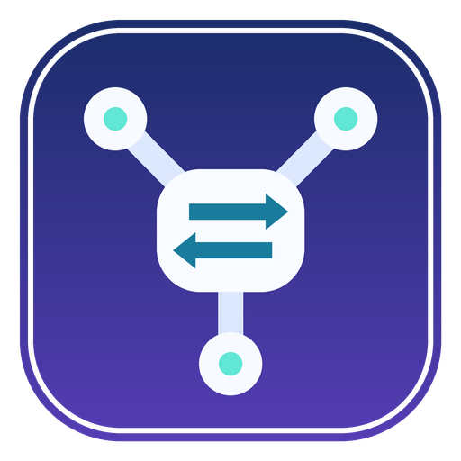
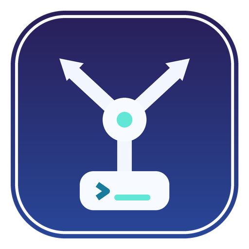

# Codex Agent Switch 应用图标

## 设计目标

图标必须同时传达“模型/方案切换”和“主代理调度多个 Worker”，并在 16px 的窗口标题栏、浅色或深色任务栏、开始菜单及安装程序中保持清晰。全部图形为本项目原创的基础几何构成，不使用第三方素材、品牌字标或现有产品 Logo。

## 概念方案

### A. Switchboard Hub（最终采用）

中央圆角控制器中的双向箭头表达模型与方案切换；三条支路和三个节点表达主代理编排多个 Worker。深靛色底板在浅色和深色系统背景上都有稳定轮廓，白色主结构与薄荷青状态点在小尺寸下仍可区分。

### B. Relay Orbit

循环箭头与三个节点强调代理之间的接力和结果回流，动势更强，但在 16px 下“控制台/主控节点”的层级不如 A 明确，因此不作为正式图标。

### C. Console Fork

底部命令控制台向上分叉为两条路由，直接表达控制台与任务拆分；语义清楚，但视觉重心偏下，作为任务栏图标时均衡性不如 A。

## 最终方案与色彩

- 最终方案：A / Switchboard Hub。
- 背景：`#182C67` 到 `#583DB7` 的克制靛蓝渐变，提供稳定的应用轮廓。
- 主结构：`#F7FBFF` / `#DDE8FF`，保证深色底上的高对比。
- 状态与协作节点：`#62E6D5`。
- 切换符号：`#197C9C`，避免纯白细节在小尺寸下粘连。
- 外围保留透明安全区，无白色底、无投影白边；圆角底板兼容 Windows 10/11 桌面图标语境，但不依赖系统材质。

## 源文件与导出清单

- 正式 SVG 源：`assets/branding/AppIcon.svg`
- 多分辨率 ICO：`assets/branding/AppIcon.ico`
- PNG：16、20、24、32、40、44、48、64、96、128、150、256、310、512 px，位于 `assets/branding/png/`
- 三个概念的 SVG/PNG：`docs/branding/concepts/`
- 可复现导出脚本：`scripts/export-icons.py`

ICO 内含 16、20、24、32、40、48、64、128、256 px 图像。正式 PNG 与 ICO 都由同一组几何常量导出，采用 4 倍画布抗锯齿后缩小，避免模糊、拉伸和边缘白边。

## 接入点

- `CodexAgentSwitch.App.exe`：PE 应用图标、任务栏/快捷方式图标，并在 WinUI `AppWindow` 初始化时显式设置窗口图标。
- `CodexAgentSwitch.Setup.exe`：PE 与安装窗口图标。
- `CodexAgentSwitch.Bootstrapper.exe`：PE 与 Runtime 检测窗口图标。
- 开始菜单快捷方式：继续指向 `CodexAgentSwitch.App.exe,0`，读取主程序嵌入的正式图标。
- 便携版：随程序包含 `AppIcon.ico`，供 WinUI 窗口图标加载；主 EXE 本身也嵌入图标。
